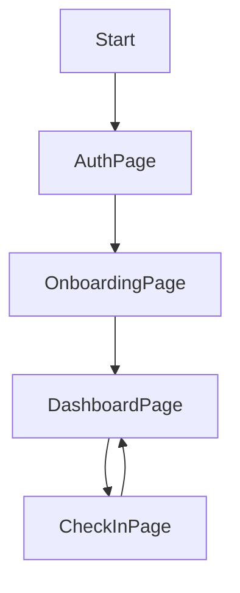

# 📐 Design Document – Personalized Diet & Workout Suggestion App

---

## 1. 🧭 Project Goal

Create a simple, AI-assisted fitness app that asks onboarding questions to personalize daily diet and workout plans. It should include a daily streak tracker and a dashboard to keep users engaged. MVP to be delivered in **1 week**.

---

## 2. 🖼️ UI Flow Design

### 2.1 **Pages & Components**

| Page             | Description                                 |
| ---------------- | ------------------------------------------- |
| `LandingPage`    | Intro + CTA (Get Started/Login)             |
| `OnboardingPage` | Series of 5–7 questions (multi-step form)   |
| `DashboardPage`  | Displays AI-generated plan + streak tracker |
| `CheckInPage`    | (Optional modal or page) for daily check-in |
| `AuthPage`       | Firebase anonymous/email login              |
| `ErrorPage`      | Generic error/fallback page                 |

---

### 2.2 **User Flow (Frontend)**



### 2.3 **Component Tree (React)**

```
<App>
 ├── <Router>
 │    ├── <LandingPage />
 │    ├── <AuthPage />
 │    ├── <OnboardingPage />
 │    ├── <DashboardPage />
 │    └── <CheckInModal />
 └── <Layout />
      ├── <Navbar />
      └── <Footer />
```

---

### 2.4 **UI Elements**

* `QuestionCard`: used in onboarding (radio/text input)
* `PlanCard`: for diet/workout suggestion
* `StreakBadge`: visual streak indicator (🔥 emoji, numbers)
* `CheckInButton`: to mark a day as complete
* `RegenerateButton`: re-triggers AI prompt

---

## 3. 🛠 Backend Architecture

### 3.1 **Tech Stack**

* **Language**: Go (Golang)
* **Framework**: net/http + Gorilla Mux or Fiber (for speed)
* **Database**: Firebase Firestore
* **AI**: Gemini API via REST

---

### 3.2 **API Endpoints**

| Method | Endpoint           | Description                              |
| ------ | ------------------ | ---------------------------------------- |
| `POST` | `/api/onboarding`  | Save onboarding answers to DB            |
| `GET`  | `/api/suggestions` | Fetch AI-generated plan (diet + workout) |
| `POST` | `/api/suggestions` | Trigger Gemini API and store result      |
| `POST` | `/api/checkin`     | Mark daily streak complete               |
| `GET`  | `/api/streak`      | Get user’s streak info                   |

> Authentication via Firebase Auth token (to be passed from frontend).

---

### 3.3 **Firestore Schema (MVP)**

```
users (collection)
 └── {uid} (doc)
     ├── onboarding: { goal, dietType, ... }
     ├── suggestions: 
     │    └── {date}: { diet: "", workout: "" }
     ├── checkins: 
     │    └── {date}: true
     └── metadata: { streakCount, lastCheckInDate }
```

---

## 4. 🔒 Auth Strategy

* Use Firebase Auth (anonymous or email+password)
* Send Firebase ID token in `Authorization` header to Go backend
* Verify token in Go using Firebase Admin SDK

---

## 5. 🔁 AI Prompt Flow (Gemini)

**Input to Gemini:**

* User's goal, preferences, fitness level (from onboarding)
* Today's date

**Prompt Template (Go-side):**

```txt
User wants to lose weight and follows a vegetarian diet. Generate a workout and diet plan for today. Be specific, yet brief.
```

**Output:**

* JSON object (or formatted text parsed on frontend)

---

## 6. 🧪 Dev Plan Tips

* Use **Tailwind CSS** or **shadcn/ui** for fast component styling
* Use **Postman** to test Go APIs before UI integration
* Use **React Context or Zustand** to manage user session/streak
* Deploy frontend via **Vercel**, backend via **Render** (or Fly.io)

---

## 7. 📦 Directory Structure

### Frontend

```
/src
 ├── components/
 ├── pages/
 ├── hooks/
 ├── services/
 └── App.tsx
```

### Backend

```
/cmd/api/
 ├── handlers/
 ├── firebase/
 ├── models/
 ├── routes.go
 └── main.go
```
